# ILCMS — Icelandic Legal Case Management System
### *Málastjórnunarkerfi fyrir Íslenska Lögmenn og Dómstóla*

> *This document was written with the assistance of AI. All code and documentation have been human-reviewed and verified.*

[](#executive-summary--security-posture)
[-emerald.svg)](#dedicated-icelandic-legal-ai-model)
[-indigo.svg)](#purpose--capabilities)
[](#purpose--capabilities)

---

## Executive Summary & Security Posture

**ILCMS (Icelandic Legal Case Management System)** is a specialized, high-security legal practice and litigation management system specifically designed for Icelandic advocates, law firms, and judicial bodies.

### The 100% Air-Gapped AI Mandate: Zero Cloud Egress
In legal practice, safeguarding attorney-client privilege (*lögmannstrúnaður* skv. lögum nr. 77/1998) and confidential client data (*persónuverndarlög nr. 90/2018*) is paramount. Commercial cloud AI tools (e.g. ChatGPT, public Gemini, Claude) transmit court briefs, witness testimonies, and corporate secrets to external data centers outside Icelandic jurisdiction.

**Under the ILCMS Architecture:**
- **ONLY the AI subsystem is 100% Air-Gapped:** The AI inference service runs entirely on-device with zero external egress.
- **Strict Network Isolation:** The AI engine is bound to a strict local loopback socket (`127.0.0.1:11434`) or placed inside an isolated Docker bridge network configured with `internal: true`. Outbound WAN packets are blocked.
- **Client Records Stay Within the System:** Every statement of claim (*stefna*), defense brief (*greinargerð*), financial audit, and privileged email is analyzed exclusively in local memory.

### Dedicated Icelandic Legal AI Model
ILCMS utilizes an on-device instance of **Gemma 2 9B Instruct** (Miðeind fine-tuned for Icelandic syntax and judicial vocabulary):
- **Icelandic Tokenizer:** 256,000-token SentencePiece vocabulary natively representing complex Icelandic declensions, legal compounds, and procedural terminology.
- **Local Vector Search:** **nomic-embed-text** running locally to generate 768-dimensional dense vector embeddings stored in an on-premises PostgreSQL `pgvector` database with HNSW indexing for instant semantic retrieval.
- **Deterministic Procedural Safeguard:** A built-in procedural rule validator enforces strict adherence to statutory deadlines even if the model is operating offline.

---

## Purpose & System Capabilities

The primary purpose of ILCMS is to provide Icelandic litigation attorneys and judges with an end-to-end procedural workflow that eliminates administrative friction, prevents missed court deadlines, and automates court compliance:

1. **Procedural Case Management (*Málaskrá*):** Structured tracking of civil actions (*einkamál*), fast-track proceedings (*flýtimeðferð skv. XIX. kafla eml.*), and appellate cases across all Icelandic jurisdictions (District Courts, Court of Appeal, and Supreme Court).
2. **Statutory Deadline Engine (*Lögboðnir Dómsfrestir skv. lögum nr. 91/1991*):** Automated computation of service of summons (80. gr.), statement of defense (96. gr. og 101. gr.), expert witness nomination (X. kafli), oral pleadings (102. gr.), and appeal deadlines (144. gr. og 154. gr.), complete with visual urgency countdowns and iCalendar (.ics) exports.
3. **Court Bundle Generator (*Málsgagnasafn skv. reglum dómstólasýslunnar nr. 1/2020*):** One-click generation of court-ready bundles, including official cover pages (*forsíða*), structured table of contents (*efnisyfirlit*), plaintiff/defendant exhibit tagging (A-1, B-1), and continuous Bates stamp numbering (`Bls. X af Y`).
4. **Legal Drafting Studio (*Málastjórnun & Skjalagerð*):** Drafting of writs (*stefnur*), defense statements (*greinargerðir*), motions to dismiss (*frávísunarkröfur*), and witness lists with version diffing and Word (.docx)/PDF exports.
5. **Statutory Fee & Cost Accounting (*130. gr. eml. Málskostnaðarreiknivél*):** Live billable timer, court filing fee calculator (*stefnugjöld 131. gr.*), outlay accounting, 24% VAT, and automated formal cost schedules for court submission.
6. **Air-Gapped Legal AI Assistant:** On-device semantic search, legal question answering, statutory cross-referencing, and precedent citations with pinpoint document references.
7. **Example Legal Document Library (`/examples`):** Production-grade library of realistic Icelandic trial materials (expert reports, construction contracts, summons, legal emails, demand letters, and surveyor petitions) importable directly into existing or newly created cases via `/api/v1/examples`.
8. **System Administration & K3s Resource Monitor (*Kerfisstjórn*):** Centralized administration console with real-time Kubernetes/K3s CPU, RAM, and Disk metrics (`/api/v1/admin/cluster-metrics`), user RBAC controls, cache diagnostics, and strict zero-egress audit verification.

---

## Documentation Library (`/docs`)

Comprehensive documentation is available in the [`/docs`](docs/) directory:

- 📖 **[docs/USERGUIDE.md](docs/USERGUIDE.md)**  
  *Notendahandbók* — A step-by-step user guide providing an overview for attorneys and staff to quickly master the system's 3-pane interface, case registration, deadlines, bundles, and cost tracking.
- 📋 **[docs/UNFINISHED.md](docs/UNFINISHED.md)**  
  *Ókláruð Verkefni & Framtíðarviðbætur* — Detailed breakdown of pending engineering tasks (Auðkenni eID, Réttargátt API, OCR for historical scans) alongside high-value future roadmap features.
- 💻 **[docs/AIRGAP_LAPTOP_POC_GUIDE.md](docs/AIRGAP_LAPTOP_POC_GUIDE.md)**  
  *Handbók um staðbundið prófunarumhverfi* — Full deployment guide for running the air-gapped system on a standard laptop with hardware budgets, cgroups, and network isolation runbooks.
- 🏛️ **[docs/ARCHITECTURE_AND_INFRASTRUCTURE.md](docs/ARCHITECTURE_AND_INFRASTRUCTURE.md)**  
  *Tæknileg Arkitektúrlýsing* — Detailed system topology, container network design, memory limits, and service interconnections (Next.js 15, PostgreSQL 16 + pgvector, Keycloak 24, Ollama).
- 📜 **[docs/REQUIREMENTS_AND_DESIGN.md](docs/REQUIREMENTS_AND_DESIGN.md)**  
  *Kröfu- og Hönnunarlýsing* — Functional requirements, statutory references, and design specifications across all legal workflows.

---

## Quick Start — One-Step Local Installation

Run the turnkey installation script directly on your Linux, macOS, or WSL laptop:

```bash
# Make installer executable and run
chmod +x install.sh scripts/*.sh
./install.sh
```

### Installation Modes
```bash
./install.sh          # Default: checks RAM, isolates local AI, installs packages and starts app
./install.sh --k3s    # Declarative deployment onto local K3s Kubernetes cluster (deploy/k8s)
./install.sh --docker # Full-stack deployment via Docker Compose with isolated AI bridge
./install.sh --ai-only # Configures and caches only the 100% air-gapped Icelandic AI model
```

- **Web Application:** `http://localhost:3000`
- **Air-Gapped AI Subsystem:** `http://127.0.0.1:11434` (Strict loopback / zero internet egress)
- **Test Credentials:** `lawyer@ilcms.is` / `ilcms_password_2026`

### Verify Air-Gap & Component Health
After running `./install.sh`, verify that all services and air-gap network boundaries are operating locally with zero outbound egress:

```bash
chmod +x verify-airgap.sh
./verify-airgap.sh
```

---

## Standalone Desktop Packages (.msi, .rpm, .deb, .dmg)

For client laptops and workstations that do not run Kubernetes (K3s) or Docker, ILCMS can be packaged into **ultra-lightweight native desktop installers** (~9.5 MB – 32 MB). These installers set up the complete system locally with a native OS desktop launcher, system menu integration, and local loopback operation.

See precompiled packages in directory [dist/desktop/](dist/desktop/).

### Building All Desktop Packages

Run the packaging script directly from the repository root:

```bash
# Build all packages (.msi, .deb, .rpm, .dmg)
chmod +x *.sh scripts/*.sh
./package-desktop.sh --all

# Or build individual package targets:
./package-desktop.sh --deb    # Debian / Ubuntu (.deb)
./package-desktop.sh --rpm    # Fedora / RHEL / openSUSE (.rpm)
./package-desktop.sh --msi    # Microsoft Windows Installer (.msi)
./package-desktop.sh --dmg    # macOS Disk Image (.dmg)
```

The resulting binaries are written directly to `dist/desktop/` with automated `SHA256SUMS` verification:

| Target Platform | Package File | Package Type | Target OS & Installation Command |
|---|---|---|---|
| **Microsoft Windows** | `ILCMS-Setup-1.0.0.msi` | Windows Installer MSI | Double-click installer or `msiexec /i ILCMS-Setup-1.0.0.msi /quiet` |
| **Ubuntu / Debian** | `ilcms_1.0.0_amd64.deb` | Debian Package DEB | `sudo dpkg -i ilcms_1.0.0_amd64.deb` |
| **Fedora / RHEL / CentOS** | `ilcms-1.0.0-1.x86_64.rpm` | RPM Package | `sudo dnf install ./ilcms-1.0.0-1.x86_64.rpm` |
| **Apple macOS** | `ILCMS-1.0.0.dmg` | Apple Disk Image DMG | Double-click DMG and drag `ILCMS.app` into `/Applications` |

### Laptop Desktop Features:
- **No Docker or K3s Needed:** Runs directly on the laptop OS using the Next.js standalone runtime with minimal system overhead.
- **Native OS Integration:** Installs application shortcuts in the Windows Start Menu & Desktop, Linux Applications Menu (`.desktop`), and macOS Applications dock.
- **Single-Click Launch:** Automatically starts the background local service on `http://127.0.0.1:3000` and opens the default web browser seamlessly.
- **100% Offline & Air-Gapped:** Pre-configured with `AIRGAP_MODE=true` for complete attorney-client privilege isolation.

---

## Visual Tour of the System (High-Resolution Screenshots)

Below are high-resolution screenshots illustrating the end-to-end legal workflows available in ILCMS.

---

### 1. Main Workspace & Case Overview

#### Figure 1: 3-Pane Legal Workspace Dashboard
*Central command center showing active matters, priority badges, court dates, and real-time air-gap security indicators.*
<br/>
<a href="assets/images/001-ilcms.png" target="_blank">
  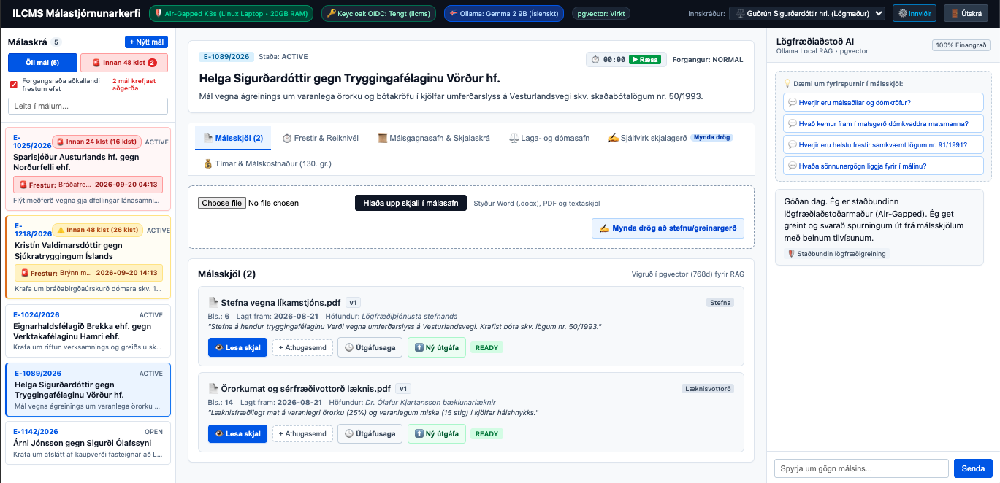
</a>

<br/>

#### Figure 2: Active Case Details & Procedural State
*Comprehensive overview of case E-1025/2026, displaying parties, assigned advocate, expedited indicators, and statutory deadline status.*
<br/>
<a href="assets/images/002-ilcms.png" target="_blank">
  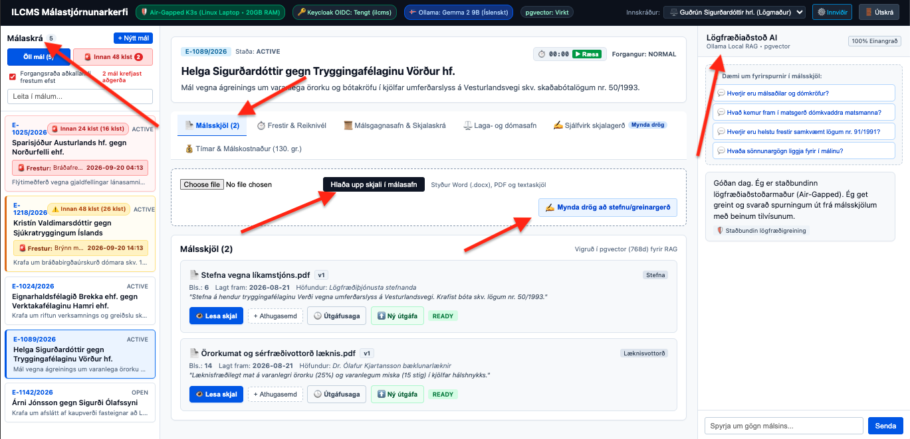
</a>

<br/>

#### Figure 3: New Case Registration Dialog (*Nýtt Dómsmál*)
*Standardized court registration modal capturing case numbers, court jurisdiction, parties, and procedural flags.*
<br/>
<a href="assets/images/003-ilcms.png" target="_blank">
  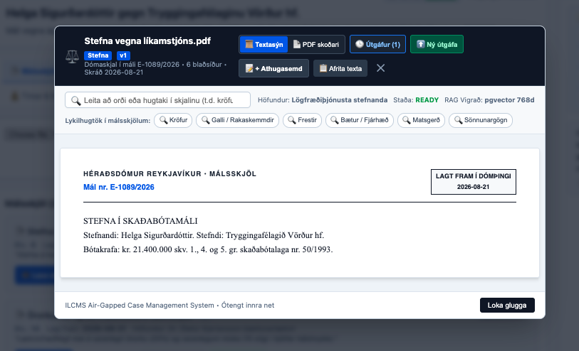
</a>

---

### 2. Document & Evidence Management (*Dómaskjöl & Málsgögn*)

#### Figure 4.1: Court Documents & Exhibit Repository
*Structured repository categorizing filings, exhibits (A-1, B-1), contracts, and expert reports.*
<br/>
<a href="assets/images/004.1-ilcms.png" target="_blank">
  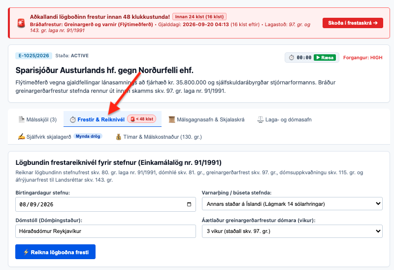
</a>

<br/>

#### Figure 4.2: Integrated Document Viewer & Native Text Extraction
*In-app preview of submitted court exhibits with real-time text extraction for search and local AI processing.*
<br/>
<a href="assets/images/004.2-ilcms.png" target="_blank">
  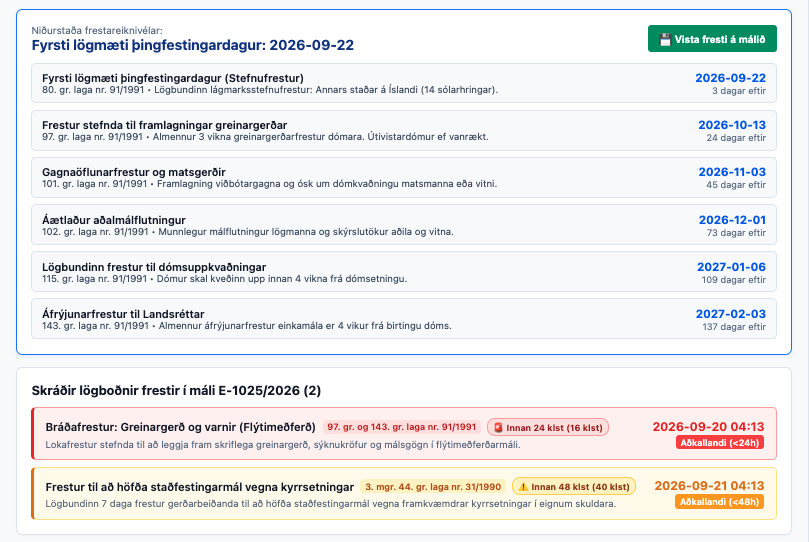
</a>

---

### 3. Statutory Deadline Engine (*Lögboðnir Dómsfrestir skv. lögum nr. 91/1991*)

#### Figure 5.1: Statutory Deadline Alert Banner
*Proactive statutory warning banner highlighting impending procedural deadlines within 24h/48h.*
<br/>
<a href="assets/images/005.1-ilcms.png" target="_blank">
  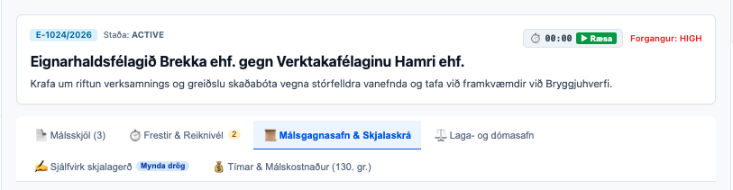
</a>

<br/>

#### Figure 5.2: Procedural Timeline & Statutory Calculator
*Interactive calculation of civil procedure milestones: service of summons, defense deadline, and oral pleadings.*
<br/>
<a href="assets/images/005.2-ilcms.png" target="_blank">
  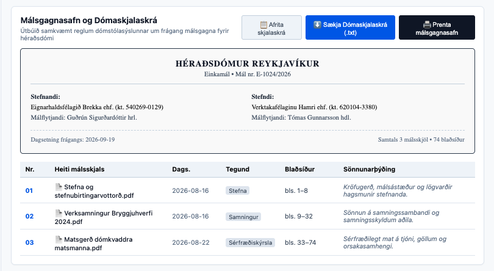
</a>

---

### 4. Court Bundle Generator (*Málsgagnasafn skv. reglum dómstólasýslunnar*)

#### Figure 6.1: Official Court Bundle Cover Page (*Forsíða*)
*Automated court bundle cover page formatted strictly according to Court Administration Rule No. 1/2020.*
<br/>
<a href="assets/images/006.1-ilcms.png" target="_blank">
  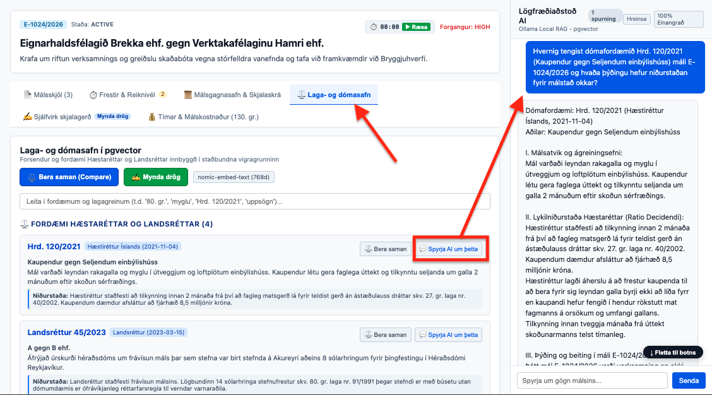
</a>

<br/>

#### Figure 6.2: Structured Table of Contents (*Efnisyfirlit*)
*Chronological table of contents listing plaintiff exhibits (A-1, A-2) and defense exhibits (B-1, B-2) with page numbers.*
<br/>
<a href="assets/images/006.2-ilcms.png" target="_blank">
  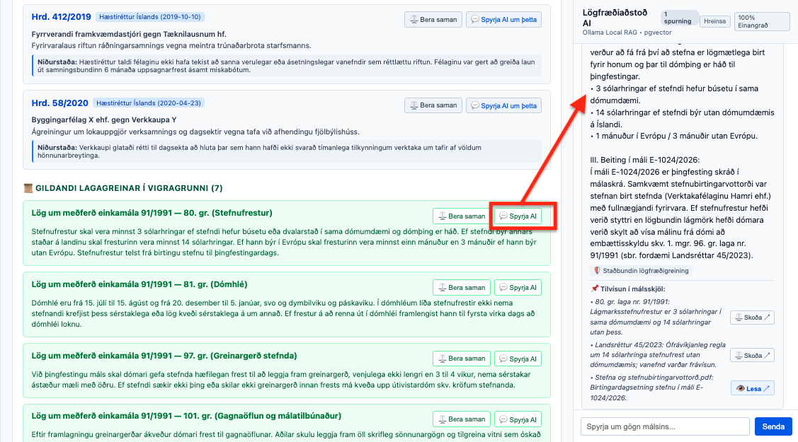
</a>

<br/>

#### Figure 6.3: Continuous Bates Stamp Pagination & PDF Export
*Final court bundle preview featuring running page footers (`Bls. X af Y`) and print-ready PDF download.*
<br/>
<a href="assets/images/006.3-ilcms.png" target="_blank">
  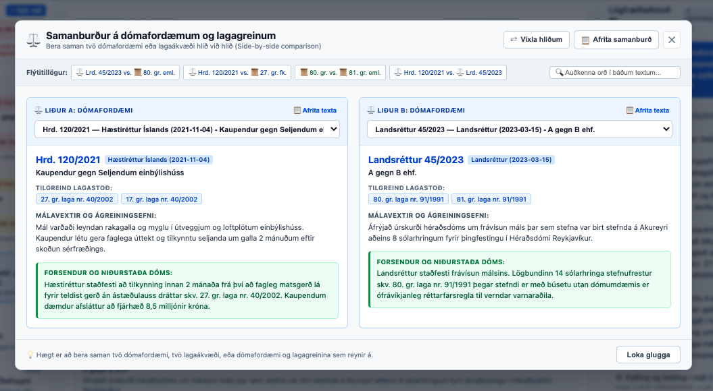
</a>

---

### 5. Electronic Legal Drafting Studio (*Málastjórnun*)

#### Figure 7.1: Legal Drafting Studio Workspace
*Full-featured drafting environment configured for Icelandic civil pleadings and judicial motions.*
<br/>
<a href="assets/images/007.1-ilcms.png" target="_blank">
  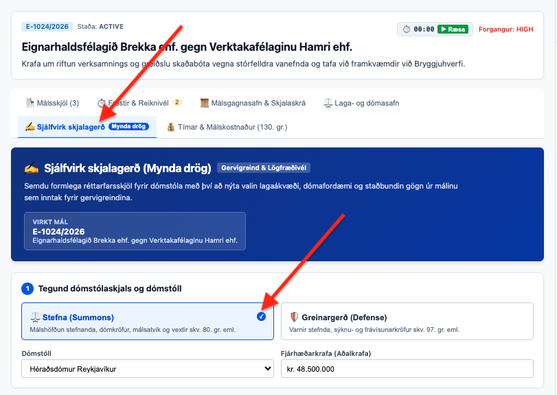
</a>

<br/>

#### Figure 7.2: Civil Pleading Template Selector
*Selection library for writs of summons (*stefna*), defense statements (*greinargerð*), and cost claims.*
<br/>
<a href="assets/images/007.2-ilcms.png" target="_blank">
  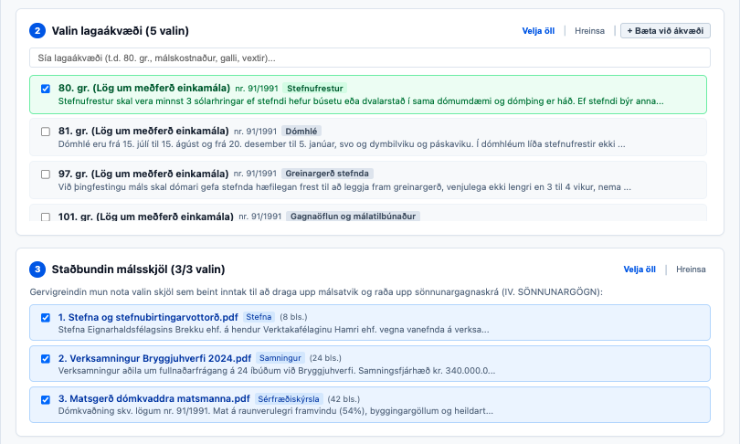
</a>

<br/>

#### Figure 7.3: Formulation of Legal Facts & Grounds (*Málsatvik & Málsástæður*)
*Structured composition of material facts, legal grounds, and evidentiary references.*
<br/>
<a href="assets/images/007.3-ilcms.png" target="_blank">
  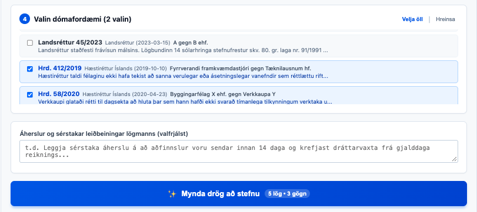
</a>

<br/>

#### Figure 7.4: 100% Air-Gapped AI Draft Generation
*On-device Gemma 2 9B model generating compliant legal paragraphs without transmitting data outside the host.*
<br/>
<a href="assets/images/007.4-ilcms.png" target="_blank">
  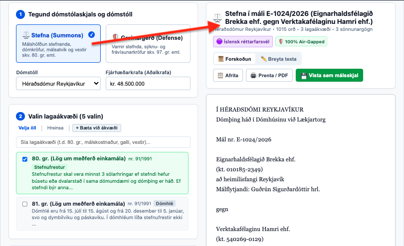
</a>

<br/>

#### Figure 7.5: Document Version Diff & Comparative Analysis
*Side-by-side legal comparison tool highlighting additions, deletions, and textual discrepancies.*
<br/>
<a href="assets/images/007.5-ilcms.png" target="_blank">
  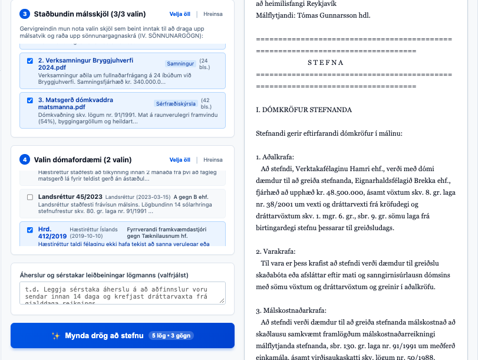
</a>

<br/>

#### Figure 7.6: Pleading Export to Microsoft Word (.docx) and PDF
*Direct export to formatted .docx and .pdf files conforming to Icelandic judicial typography standards.*
<br/>
<a href="assets/images/007.6-ilcms.png" target="_blank">
  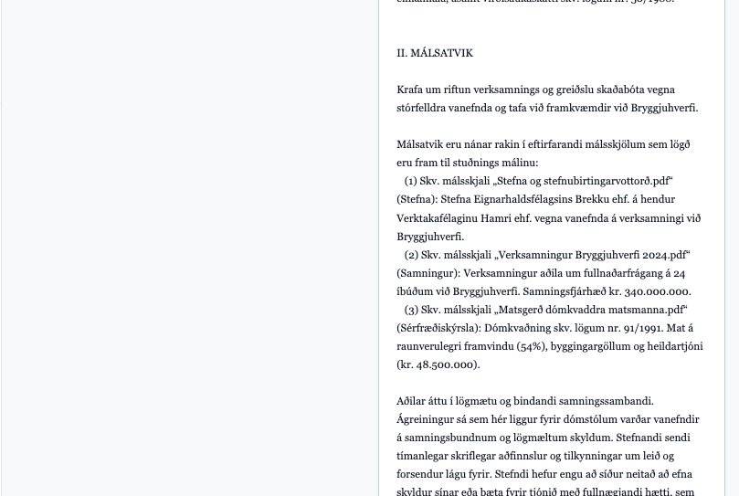
</a>

---

### 6. Billable Hours & Litigation Costs (*130. gr. eml. Málskostnaður*)

#### Figure 8.1: Litigation Cost Overview & Time Ledger
*Comprehensive tracking of advocate hours, outlays, court fees, and VAT under Article 130 of Act No. 91/1991.*
<br/>
<a href="assets/images/008.1-ilcms.png" target="_blank">
  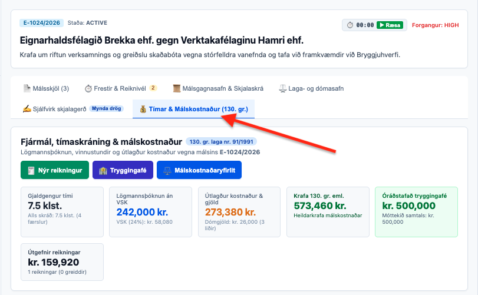
</a>

<br/>

#### Figure 8.2: Live Billable Activity Timer
*Interactive real-time timer logging advocacy, brief drafting, research, and negotiation.*
<br/>
<a href="assets/images/008.2-ilcms.png" target="_blank">
  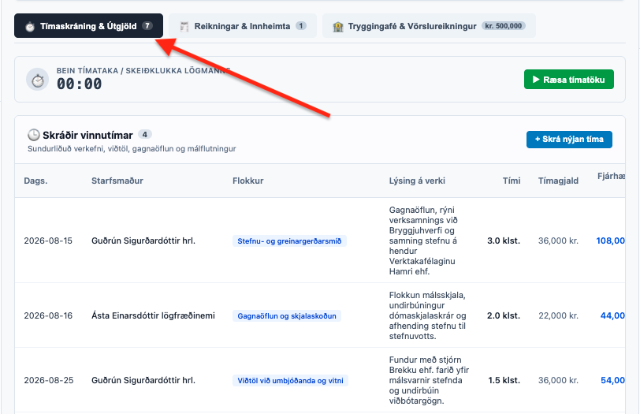
</a>

<br/>

#### Figure 8.3: Court Fees & Procedural Outlays (*131. gr. eml.*)
*Automated court fee calculation based on principal claims and registry of third-party disbursements.*
<br/>
<a href="assets/images/008.3-ilcms.png" target="_blank">
  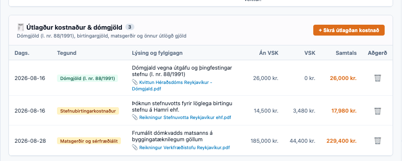
</a>

<br/>

#### Figure 8.4: Itemized Fee Schedule & 24% VAT Breakdown
*Automated billing calculation detailing net professional fees, outlays, and statutory VAT.*
<br/>
<a href="assets/images/008.4-ilcms.png" target="_blank">
  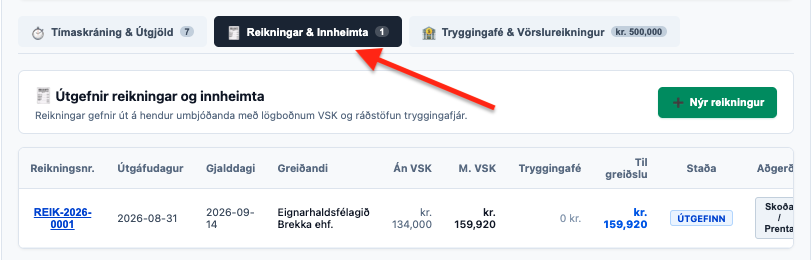
</a>

<br/>

#### Figure 8.5: Formal Court Cost Schedule (*Málskostnaðaryfirlit*)
*Court-ready schedule of costs ready for submission to the presiding judge at the conclusion of oral arguments.*
<br/>
<a href="assets/images/008.5-ilcms.png" target="_blank">
  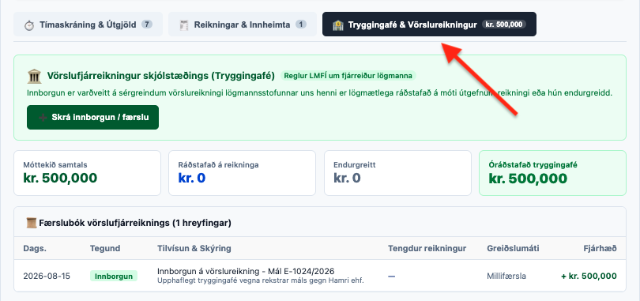
</a>

---

### 7. Air-Gapped AI Assistant & Infrastructure Monitoring

#### Figure 9.1: 100% Air-Gapped Legal Assistant Pane
*Context-aware legal assistant analyzing active exhibits with strict confidential local inference.*
<br/>
<a href="assets/images/009.1-ilcms.png" target="_blank">
  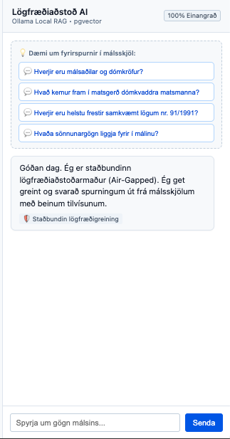
</a>

<br/>

#### Figure 9.2: Air-Gapped Infrastructure & Egress-Free Status
*Live diagnostic dashboard verifying local Ollama service, memory headroom, and zero outbound network egress.*
<br/>
<a href="assets/images/009.2-ilcms.png" target="_blank">
  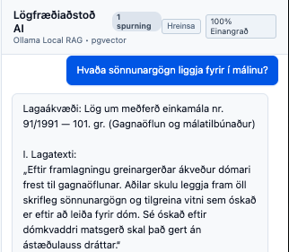
</a>

<br/>

#### Figure 9.3: Statutory Law & Precedent Citations (RAG)
*Instant statutory reference linking relevant provisions of Act No. 91/1991 and Supreme Court precedent to case facts.*
<br/>
<a href="assets/images/009.3-ilcms.png" target="_blank">
  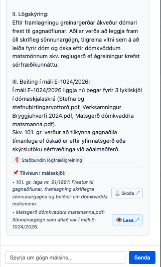
</a>

---

### 8. System Administration & K3s Resource Monitor (*Kerfisstjórn*)

- **Centralized Admin Console (`AdminConsoleModal`):** One-click administrative console accessible via `#btn-admin-console`.
- **Live K3s Cluster Monitor (`K3sResourceMonitorWidget`):** Live telemetry for CPU load percentage, RAM usage (active vs limits vs free buffer), and disk volume occupancy reading real host and cgroup counters from `/api/v1/admin/cluster-metrics`.
- **Example Documents Engine (`/examples`):** Instant repository inspection and case import modal (`ExampleDocsPickerModal`) allowing attorneys to test the full litigation lifecycle with complete, authentic Icelandic evidence packets.

#### Figure 10.1: System Administration Dashboard & Live K3s Cluster Monitor
*Comprehensive cluster telemetry displaying CPU core load, memory allocation (AI model, Postgres, exhibits, K3s buffer), NVMe storage occupancy, and individual microservice statuses.*
<br/>
<a href="assets/images/010.01-ilcms.png" target="_blank" title="Click to view full-resolution image (2424x1492)">
  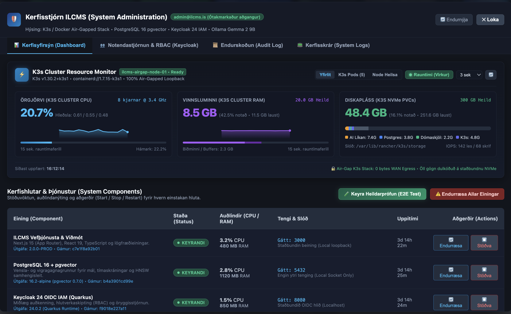
</a>

<br/>

#### Figure 10.2: Granular Kubernetes Pod Resource Telemetry
*Detailed breakdown of Kubernetes pods across all namespaces (default, database, auth, ai, kube-system) with exact millicore CPU, RAM usage, and attached persistent storage (PVC).*
<br/>
<a href="assets/images/010.02-ilcms.png" target="_blank" title="Click to view full-resolution image (2428x1502)">
  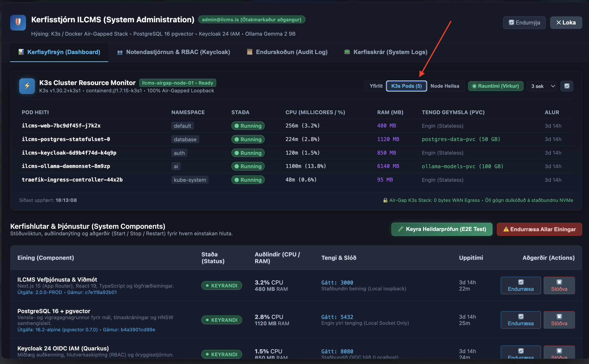
</a>

<br/>

#### Figure 10.3: K3s Node Health & Kubelet Pressure Diagnostics
*Node health indicators verifying Kubelet status (Ready), memory pressure (False), disk pressure (False), process ID thresholds, and local loopback isolation.*
<br/>
<a href="assets/images/010.03-ilcms.png" target="_blank" title="Click to view full-resolution image (2426x1452)">
  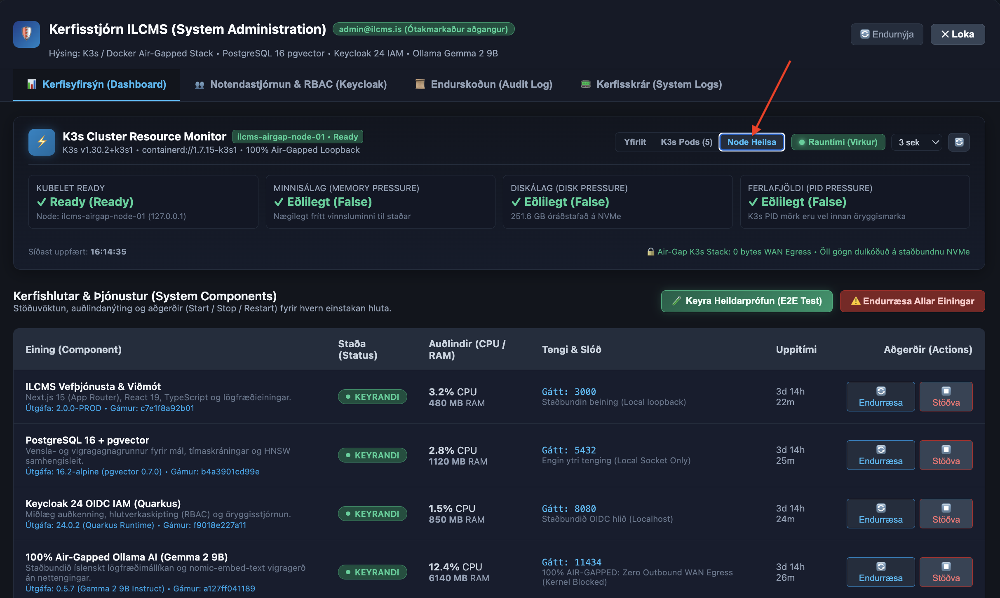
</a>

<br/>

#### Figure 10.4: Keycloak 24 IAM & Role-Based Access Control (RBAC)
*User administration and role management interface displaying advocates, judges, paralegals, and administrators with multi-factor authentication (MFA) and granular permissions.*
<br/>
<a href="assets/images/010.04-ilcms.png" target="_blank" title="Click to view full-resolution image (2420x1200)">
  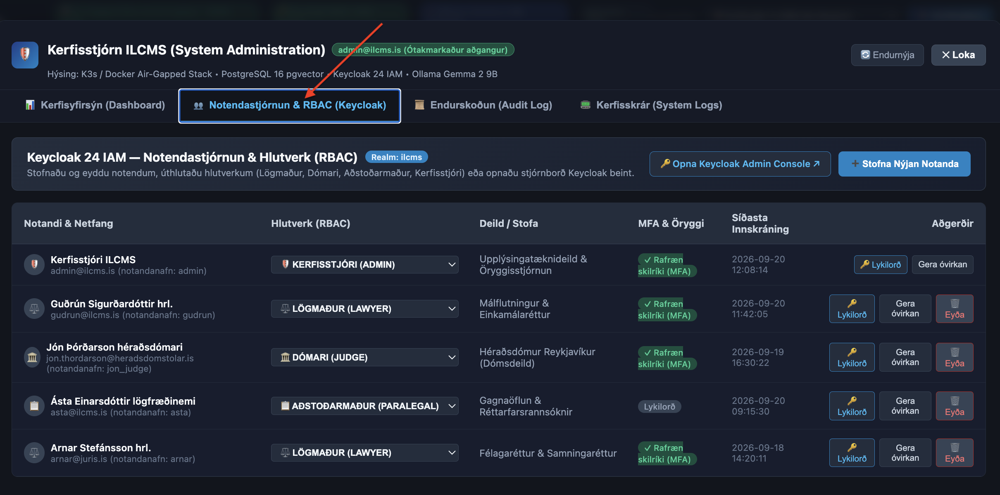
</a>

<br/>

#### Figure 10.5: Zero-Egress Security & Litigation Audit Log
*Forensic litigation audit trail logging user actions, PDF court bundle exports, on-device AI queries (0 bytes sent outside), and blocked unauthorized external connection attempts.*
<br/>
<a href="assets/images/010.05-ilcms.png" target="_blank" title="Click to view full-resolution image (2426x1180)">
  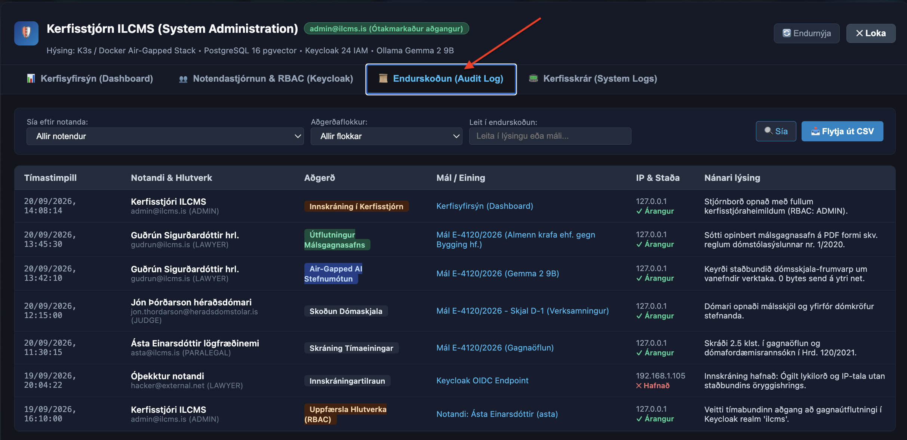
</a>

<br/>

#### Figure 10.6: Real-Time Microservice Logs & Air-Gap Egress Firewall Stream
*Live system log streaming console across all microservices (Ollama, PostgreSQL pgvector, Keycloak, Web) verifying zero outbound WAN egress and HNSW vector performance.*
<br/>
<a href="assets/images/010.06-ilcms.png" target="_blank" title="Click to view full-resolution image (2422x1000)">
  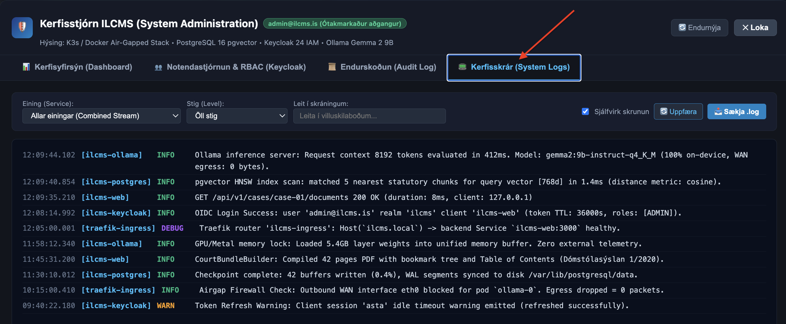
</a>

---

## Technology Stack

- **Frontend & Server API:** Next.js 15 (App Router), React 19, TypeScript, Tailwind CSS.
- **On-Device AI Inference:** Ollama 0.5.7 with fine-tuned **Gemma 2 9B Instruct** & **nomic-embed-text** (100% Air-Gapped / Zero Egress).
- **Relational & Vector Database:** PostgreSQL 16 Alpine with `pgvector` extension and HNSW indexing.
- **Identity Provider:** Keycloak 24 (Quarkus runtime) with OIDC authentication.
- **Cluster & Infrastructure Telemetry:** Real-time K3s resource monitoring (`/api/v1/admin/cluster-metrics`).
- **Trial Examples Ingestion:** Dynamic `/examples` catalog and import API (`/api/v1/examples`).
- **Document Engines:** PDFKit / jsPDF for court bundles; Mammoth for DOCX ingestion; standard iCalendar (.ics).

---

## Linguistic Standards

All user-facing views, tables, and system diagnostics strictly adhere to standard Icelandic legal terminology and grammar (including proper nominative status labeling **STAÐA** instead of grammatical errors).

---

## License & Legal Disclaimers

Copyright © 2026. Built in conformity with Icelandic Civil Litigation Act No. 91/1991 (*lög um meðferð einkamála*) and Court Administration Rules (*reglur dómstólasýslunnar*). All AI processing is performed strictly on local hardware with zero external telemetric reporting.
